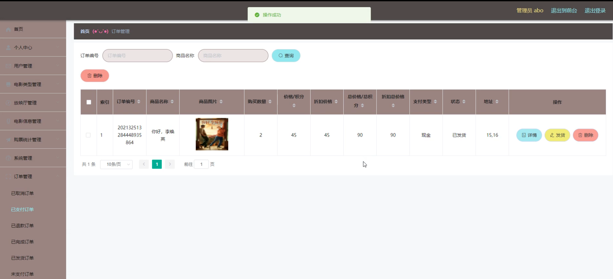

# 基于Springboot的小徐影城管理系统

---
### 👉作者QQ ：1556708905 微信：zheng0123Long (支持定制修改、部署调试、定制毕设)

### 👉接网站建设、小程序、H5、APP、各种系统等

---

#### 介绍

基于Springboot的小徐影城管理系统是一款专为电影院设计的高效管理平台，旨在提升影院运营效率和用户观影体验。系统分为管理员角色和用户角色，分别提供了多种功能模块，以满足影院管理和用户购票的需求。

#### 技术栈介绍

后端技术栈：Springboot+Mysql+Maven

前端技术栈：Vue+Html+Css+Javascript+ElementUI

开发工具：Idea+Vscode+Navicate

#### 系统功能截图

管理员角色功能模块

个人中心：管理员可以查看和编辑个人信息，包括修改密码和更新联系方式，确保个人信息的准确性和安全性。

用户管理：管理用户信息，包括新增、修改和删除用户账号，确保用户信息的准确和及时更新。

电影类型管理：管理电影的分类信息，方便电影分类的维护和查询。

放映厅管理：管理影院的放映厅信息，包括新增、修改和删除放映厅，确保放映厅的有效使用和管理。

电影信息管理：管理电影的详细信息，包括新增、修改和删除电影，确保电影信息的准确性和及时更新。

购票统计管理：统计购票信息，分析销售数据，为影院运营提供数据支持和决策依据。

系统管理：负责系统的配置和管理，包括权限设置、系统日志查看等，确保系统的安全性和稳定性。

订单管理：管理用户的购票订单，跟踪订单状态，处理订单相关的问题和需求。

用户角色功能模块

电影信息：用户可以浏览和查询电影的详细信息，了解上映时间、影院位置等，方便购票和观影。

电影资讯：查看最新的电影资讯和影评，了解电影动态和推荐。

个人中心：用户可以查看和编辑个人信息，包括修改密码和更新联系方式，确保个人信息的准确性和安全性。

后台管理：用户在后台可以进行多项操作，方便管理个人的购票记录和收藏。

在线咨询：用户可以在线咨询相关问题，获取帮助和支持，提升观影体验。

#### 系统作用

对管理员的作用

高效管理：系统提供了全面的管理工具，帮助管理员高效地管理用户、电影和放映厅信息，确保管理工作的高效性和准确性。

信息传达：通过购票统计管理模块，管理员可以快速获取影院的销售数据和运营状况，支持经营决策。

订单处理：通过订单管理模块，管理员可以有效跟踪和处理用户的购票订单，提升服务质量。

对用户的作用

信息获取：用户可以方便地浏览电影信息和资讯，及时了解电影动态和推荐。

便捷操作：用户可以通过系统便捷地进行购票、查看购票记录和在线咨询，提升观影体验。

个人管理：个人中心模块帮助用户管理和更新个人信息，确保个人信息的准确性和及时性。

#### 系统功能截图

代码结构

数据库表

登录

放映厅管理

电影信息管理

系统管理

前台页面首页

个人中心

电影资讯

在线咨询

订单管理

#### 总结

基于Springboot的小徐影城管理系统通过角色分工和功能模块的设计，实现了影院的高效管理和用户的便捷购票。管理员可以通过系统全面管理用户、电影和放映厅信息，确保影院的有序运营；用户则可以方便地获取电影信息和进行购票操作，提升观影体验。该系统不仅提高了影院管理的效率，也为用户提供了更好的服务和支持。

#### 使用说明

创建数据库，执行数据库脚本 修改jdbc数据库连接参数 下载安装maven依赖jar 启动idea中的springboot项目

后台地址：http://localhost:8080/springbootm3kwm/admin/dist/index.html

管理员  abo 密码 abo

前台地址：http://localhost:8080/springbootm3kwm/front/index.html
